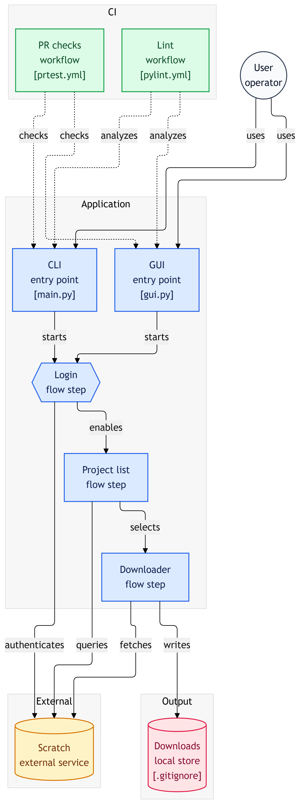

# SB3 Bulk Downloader
Have you ever wanted to download all your Scratch projects to your computer, but didn't want to dedicate an entire weekend to hitting "Download Project" 200 times? 

That's right, of course you have, and so have we! In true programming fashion, we didn't want to waste _hours_ of our lives manually hitting a button 200 times, so we dedicated _weeks_ of our lives to code a program that would hit the button 200 times for us!

That program is this: it will help you quickly download all your projects from your _own_ Scratch account without needing to download them manually or wait 3 months for a reply from the "Help Center."

## Walkthrough

### Installation
todo

### Usage
There are two ways to use SB3 Bulk Downloader: the CLI or the GUI.

#### Running the GUI
This is the more visual method, so most people will find it more intuitive.
1. Log in with your Scratch username and password. This is used *only* to access Scratch. It is *not* stored anywhere. (For the more paranoid among you, it's open-source. Look at the code yourself.)
2. At the project select screen, click the "Sort by" button to filter your My Stuff page. Projects may take some time to load.
3. Click "Select all" or click the individual checkboxes to choose which projects to download.
4. Click the "Download selected" button when you are ready.
5. Sit back and watch the progress bars, which show how much of each project is downloaded as well as the number of currently downloaded projects.
6. Sit back, play games, and go grab an extremely caffeinated coffee so you can sit and relax and sip away ~as your heart rate rises~
7. Don't close the program, unplug your computer, or lose Internet while doing this or your download will go kaboom :smiley:

#### Running the CLI
1. Run `main.py`
2. Log in with your Scratch username and password (This allows you to download unshared projects as well)
3. Filter your project list: whether you want all, only unshared, or only shared projects to download
4. Sit back, play games, and go grab an extremely caffeinated coffee so you can sit and relax and sip away ~as your heart rate rises~
5. Don't close the program, unplug your computer, or lose Internet while doing this or your download will go kaboom :smiley:

## How It Works
The bulk downloader has two main files: `main.py` and `gui.py`.

`main.py` handles the main logic with TimMcCool's `scratchattach` library in order to fetch the projects from Scratch. It also contains the code for the CLI downloader.

`gui.py` uses `customtkinter` for the GUI elements, which are organized into classes. These classes connect to the functions in `main.py`.

A diagram, courtesy of [GitDiagram](https://gitdiagram.com/)

## Support & Troubleshooting
If you run into any bugs, we will do our best to squash them. Simply write a detailed issue that describes your problem.

However, another reason the downloader does not work may be that the Scratch servers are down. In this case, the program cannot access Scratch to download the projects from it. The only solution is to wait it out.